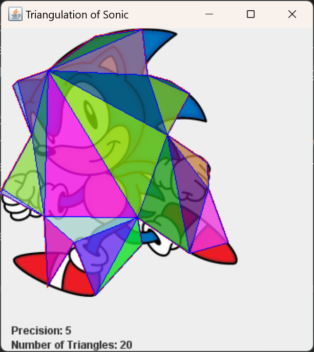
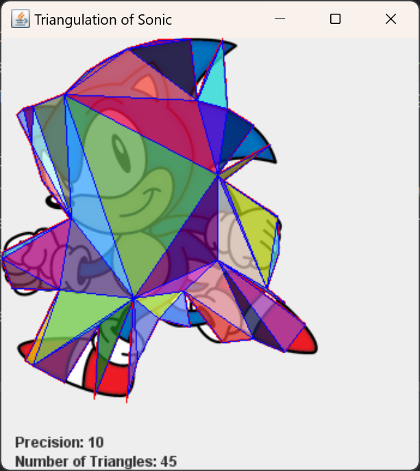
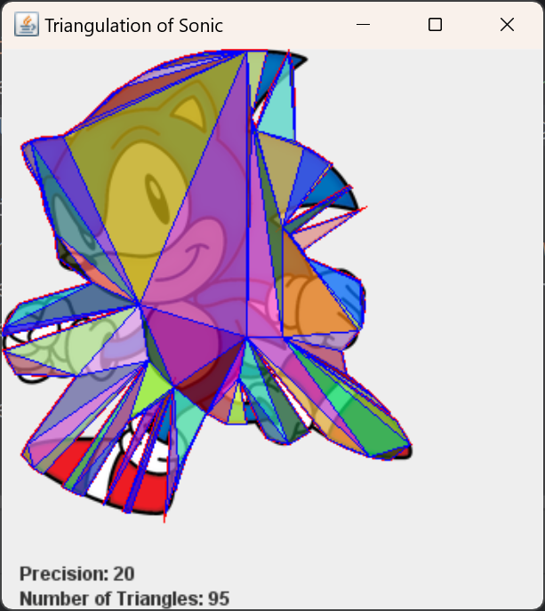
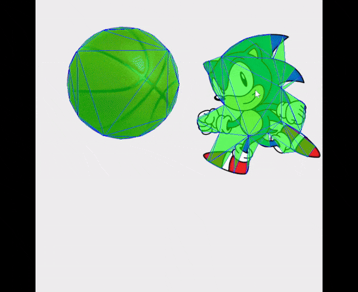

A simple java project that uses ray-casting boundary detection and triangulation (using Ear Clipping by [earcut4j](https://github.com/earcut4j/earcut4j)) to model an image. Then detecting collision between two sprites using said triangles.

Some triangulation samples:

  
  
  

A collision detection sample:

  

